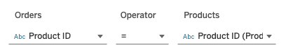
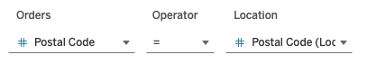
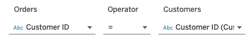
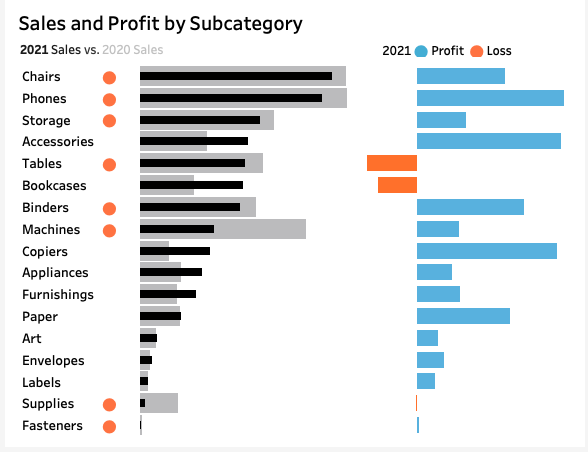
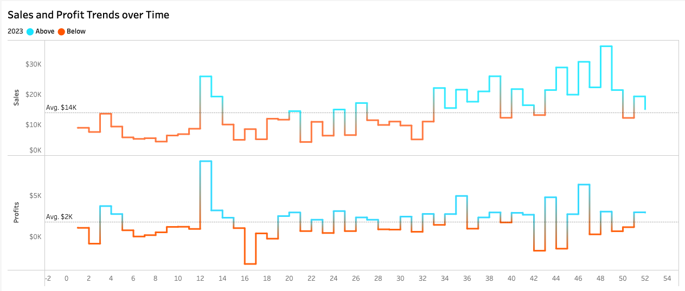
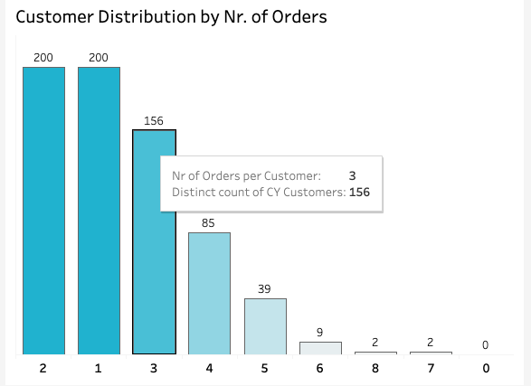
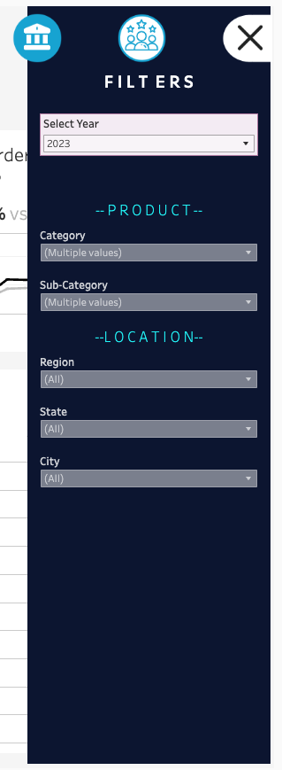

<<<<<<< HEAD
# Sales Project Objectives 
This user story outlines the specifications for building two dashboards namely the Sales and Customer Dashboards using tableau to help stakeholders, including sales managers and executives to analyze sales performance and customers. 
=======
# Sales Analysis 

The goal of this project is to assist stakeholders, such as sales managers and executives, in evaluating sales performance as well as customer shopping trends and behaviors. This is accomplished by developing two dashboards, specifically the 'Sales Dashboard' and 'Customer Dashboard'.
>>>>>>> 123346a22ba91c8bdd93651141fc5476f674fd95

Please click [here](https://public.tableau.com/views/Sales_Dashboard_17338076965380/SalesDashboard?:language=en-GB&:sid=&:redirect=auth&:display_count=n&:origin=viz_share_link) to access the interactive dashboard available on my Tableau public profile.

 

# About the dataset
The dataset comprises of four different csv files namely Orders, Customers, Location and Products. The Orders table serves as the Primary table whic contains the primary key that references the other foreign/secondary tables (Customers, Location, Products). The Customers, Location and Products tables contain child records that add data to the parent/primary records in the Orders table.

  

  

  

  

<<<<<<< HEAD
=======

 
>>>>>>> 123346a22ba91c8bdd93651141fc5476f674fd95

# Sales Dashboard
The purpose of the sales dashboard is to present an overview of the sales metrics and trends in order to analyze year-over-year sales performance and understand sales trends.

<<<<<<< HEAD

## Key Requirements
=======

>>>>>>> 123346a22ba91c8bdd93651141fc5476f674fd95

## Key Requirements

#### KPI Overview
In this segment, the KPIs (i.e total sales, profits and quantity) for the current (selected) year and the previous year are compared while also identifying the highest and lowest total sales of the selected year.

* **Total Sales**: Only 2020 to 2021 showed a decrease in sales but total sales grew back to back years from 2021 to 2023 with 2021 to 2022 having the highest increment.

* **Total Profits**: Total profits have a positive increment for all three years back to back with 2021 to 2022 having the highest increment.

* **Total Quantity**: Total sales quantity increased back to back for each of the three years with 2022 to 2023 having the highest increment.

<<<<<<< HEAD

### Sales and Profit of Product Subcategories
This segment comprises of two bar plots plotted side by side. One represents the sales/profit of each product subcategory and the other represents the profit/loss diagram. Both are plotted beside each other to display the profit or loss of each sub category. In addition, the sales/profit is also further narrowed down to compare between the selected year and previous year.
=======
#### Sales and Profit of Product Subcategories
The plots in this segment show the total sales and the profit/loss of each product subcategory. The total sales is also further narrowed down to compare between the current and previous year.
>>>>>>> 123346a22ba91c8bdd93651141fc5476f674fd95

- Phones and chairs subcategories have the highest sales consistently each year from 2020 to 2023. Both products also returned profits each year for all four years.
- The tables subcategory show consistent losses throughout all the 4 years with the highest incurred losses occurring in 2023 at a loss of $8000.

<<<<<<< HEAD
By analyzing the performance of various product categories, the business can concentrate on strategies aimed at enhancing the sales of those categories that are underperforming, thereby boosting overall sales figures.
=======
#### Weekly Sales & Profit Trends
This plot shows the sales and profits of each week in the selected year. Weeks that have sales and profits above average are indicated in blue and weeks that have sales and profits below average are indicated in orange.
>>>>>>> 123346a22ba91c8bdd93651141fc5476f674fd95

### Weekly Sales and Profit Trends
This line plot shows the weekly sales and profits in the selected year as two separate line plots. In addition, the plot also defines a threshold where users can tell whether a sales and profits in a particular week is above or below average. Weeks that have above average sales/profits are coloured in blue and orange for below average sales/profits.

- For the sales chart, a common trend for all four years shows that sales for the first half of the year tend to be below average and it starts to increase above average towards the end of the year.
- For the profits chart, the trend shows fairly balanced levels for all weeks throught the year for each of the four years.

<<<<<<< HEAD
Through the examination of weekly sales and profit data over time, the business can discern seasonal trends that indicate which times of the year typically yield higher sales and profits. The company can leverage on these insights to implement targeted promotions aimed at further boosting customer traffic and purchase rates. Similarly, strategies can also be developed to enhance sales and profit performance during the less favorable periods of the year.

=======
 
>>>>>>> 123346a22ba91c8bdd93651141fc5476f674fd95

# Customer Dashboard
The customer dashboard aims to provide an overview of customer data, trends and behaviors. This helps in assisting marketing teams and management to better understand different customer segments and improve customer satisfaction through targeted recommendations and advertisements.

 

## Key Requirements

<<<<<<< HEAD
### KPI Overview
This segment provides a summary of KPI metrics such as total number of customers , total sales per customer and total number of orders. Each KPI is compared between the selected year and the previous year. Months with the highest and lowest sales are also identified. 
=======
#### KPI Overview
This segment provides a summary of total number of customers , total sales per customer and total number of orders for the current year and the previous year. For each of the above mentioned KPI, they are presented on a monthly basis comparing between the current year and the previous year. Months with the highest and lowest sales are also identified. 
>>>>>>> 123346a22ba91c8bdd93651141fc5476f674fd95

- The total number of customers increased the most from 2021 to 2022 with an increase of 11.3%.
- The total sales per customer increased the most from 2021 to 2022 with an increase of 16.3%.
- The total number of orders increased the most from 2022 to 2023 with an increase of 28.3%. 2021 to 2022 also had almost a similarly large increase of 26.7%.

#### Customer Distribution by Number of Orders
In order to obtain insights into customer behavior, loyalty and engagement, the customer distribution is analyzed based on the number of orders that they have placed. 

- Throughout the years, the number of orders that customers mostly place per transaction is around 1 to 3.

This insight can assist the business in assessing whether their product pricing is appropriate or if additional incentives are necessary to encourage customers to enhance their purchase frequency per transaction.

<<<<<<< HEAD
### Top 10 customers by Profit
The customer dashboard also shows the top 10 most valuable customers for each year. The ranking is based on the amount of sales/profit contributed. The ranking list also shows the number of orders each customer had placed as well as their last order date.
=======
#### Top 10 customers by Profit
The top 10 customers that generated the highest profit and sales for the company are identified and ranked accordingly together with their total number of orders placed as well as the total sales and profit generated. Their last order dates are also recorded.
>>>>>>> 123346a22ba91c8bdd93651141fc5476f674fd95

- The top customer generated the most profit and sales for the company in 2022 at $8765 and $14203 respectively.
- Comparing the top 10 customers of each year, none of the customers made more than 5 purchases. 

Identifying the most valuable customers allows the business to implement rewards or incentive programs aimed at fostering loyalty, with the expectation that these customers will maintain their support for the company.

# Navigation buttons
Navigation buttons were also added to allow stakeholders/users to navigate smoothly from dashboard to dashboard. Filters were also put up to filter the data by Years, Product category/subcategory and Location details such as Region, State and City.

